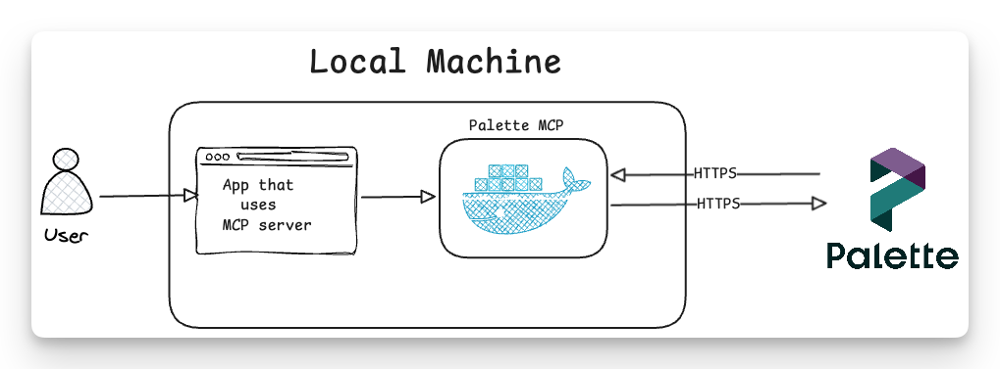

# Palette MCP Server

The Palette MCP server is a tool for interacting with Palette through the Model Context Protocol (MCP). You can use it to expose function calls to your Large Language Model (LLM) to interact with Palette.

> [!WARNING]
> This is an experimental project and subject to breaking changes.

The Palette MCP is a local-first MCP server. The MCP server is hosted in a container that is deployed on your machine. API calls to Palette are sourced from your local machine and target the configured Palette instance.



## Tools

The Palette MCP server provides several tools for interacting with Palette. Several of the function calls expect an action parameter to be provided. The action parameter is used to determine the action to perform. For example, the `gather_or_delete_clusters` tool expects an action parameter of `list`, `get`, or `delete`. If an action contains a dangerous method, the `ALLOW_DANGEROUS_ACTIONS` environment variable must be set to `1` to enable the dangerous method. Otherwise, the dangerous method will be rejected. Check out the [Usage](#usage) section to learn more about how to use the tools. Some tools require explicit enablement before they can be used. Refer to the [Dangerous Actions](#dangerous-actions) section for more information.

| Tool                               | Description                                                                                                                                               | Dangerous Method Included? | Dangerous Method? |
| ---------------------------------- | --------------------------------------------------------------------------------------------------------------------------------------------------------- | -------------------------- | ----------------- |
| `gather_or_delete_clusters`        | Gather information about clusters or delete a cluster in Palette.                                                                                         | Yes                        | Delete            |
| `gather_or_delete_clusterprofiles` | Gather information about cluster profiles or delete a cluster profile in Palette.                                                                         | Yes                        | Delete            |
| `getKubeconfig`                    | Download the kubeconfig or admin kubeconfig for a cluster.                                                                                                | No                         | None              |
| `search_and_manage_resource_tags`  | Search and manage tag lifecycle operations across the following Palette resources: clusters, cluster profiles, cluster templates, edge hosts, and policy. | Yes                        | Delete            |
| `search_gather_packs`              | Search for packs by display name or retrieve a specific pack's details by using its ID.   | No                         | None              |

The list above will continue to grow as we add more tools to the Palette MCP server.

## Get Started

To get started with the Palette MCP server, you can use the container image we provide. Review the following steps to get started.

### Prerequisites

The following items are required to use the Palette MCP server:

- A Palette account.
- A Palette API key. Check out the [Create API Key](https://docs.spectrocloud.com/user-management/authentication/api-key/create-api-key/) guide for additional guidance.
- [Docker](https://docs.docker.com/get-docker/) or [Podman](https://podman.io/getting-started/installation) installed on your machine.
- Network access to the Palette API from your machine.
- A pre-existing folder to store kubeconfig file retrieved from Palette. This is optional but improves the experience when retrieving Kubeconfig files.

### Setup

Start by creating a `.env-mcp` file in your home directory under the `.palette` folder. If this folder does not exist, create it.

```bash
mkdir -p ~/.palette
touch ~/.palette/.env-mcp
```

The `.env-mcp` file should contain the following variables.

```bash
SPECTROCLOUD_DEFAULT_PROJECT_ID=your-project-id
SPECTROCLOUD_APIKEY=your-api-key
SPECTROCLOUD_HOST=api.spectrocloud.com
ALLOW_DANGEROUS_ACTIONS=0
```

Next, create a folder to store the kubeconfig file on the host machine. This is optional but improves the experience when retrieving Kubeconfig files. The configuations below assumes the host machine folder is `/home/demouser/kubeconfig` but you can use any folder you prefer. In the following command replace the `/home/demouser/kubeconfig` with the path to your kubeconfig folder.

```bash
mkdir -p /home/REPLACEME/kubeconfig
```

Next, use the Palette MCP server, add the following MCP configuration to your application. If you don't want to use Docker, swap out the `docker` command for `podman` in the `command` field. Update the file paths to match your environment. Specify full paths to the kubeconfig folder and the `.env-mcp` file. Be aware that ENV variables such as `$HOME` will not be interpolated in most tools.

> [!WARNING]
> Ensure you use full path specifications for the kubeconfig folder and the `.env-mcp` file. Do not use relative paths, or `~`, `$HOME`, or other environment variables. Docker requires full paths to be specified for the `--mount` flag. And most tools do not support environment variable interpolation for MCP configurations.

```json
  "mcpServers": {
    "palette": {
      "command": "docker",
      "args": [
        "run",
        "--rm",
        "-i",
        "--pull",
        "always",
        "--mount",
        "type=bind,source=/FILE_PATH_REPLACE_ME/kubeconfig,target=/tmp/kubeconfig",
        "--env-file",
        "/FILE_PATH_REPLACE_ME/.env-mcp",
        "public.ecr.aws/palette-ai/palette-mcp-server:latest"
      ]
    }
  }
```

</details>

<details><summary>💾 Without Env File</summary><br>

If you don't want to use the `.env` file, you can add the environment variables directly to the MCP configuration.
However, this is not recommended as it may create a scecario where this could get committed to a repository.

```json
{
  "mcpServers": {
    "palette": {
      "command": "docker",
      "args": [
        "run",
        "-i",
        "--mount",
        "type=bind,source=/FILE_PATH_REPLACE_ME/kubeconfig,target=/tmp/kubeconfig",
        "--rm",
        "-e",
        "SPECTROCLOUD_HOST=api.spectrocloud.com",
        "-e",
        "SPECTROCLOUD_APIKEY=your-api-key",
        "-e",
        "SPECTROCLOUD_DEFAULT_PROJECT_ID=your-project-id",
        "-e",
        "ALLOW_DANGEROUS_ACTIONS=0",
        "public.ecr.aws/palette-ai/palette-mcp-server:latest"
      ]
    }
  }
}
```

</details>

### Validate

Open up the application you configured to use the Palette MCP server. Issue the following command to ensure the container is active:

```shell
docker ps | grep palette-ai/palette-mcp-server
```

For example, if you are using Cursor, an output similar to the following should be displayed:

```shell
de70907c4b6f   public.ecr.aws/palette-ai/palette-mcp-server:latest   "uv run python src/s…"   2 minutes ago   Up 2 minutes             palette-mcp-cursor
```

Next, issue a prompt that uses the Palette MCP server tools. For example, you can issue the following command:

```shell
Can you use help me identify how many active clusters I have in Palette?
```

Some applications may require your approval to use the Palette MCP server tools.

## Usage

There are various ways to use the Palette MCP server tools. The primary way to use the tools is to enable integration with a Large Language Model (LLM) to access the tools. You can enable integration with a LLM by adding the Palette MCP server to the MCP configuration of your application.

### Scope

If you specified a `SPECTROCLOUD_DEFAULT_PROJECT_ID` in the `.env-mcp` file, the Palette MCP server will always default to using the provided project ID. If you do not provide a project ID, then the tool call requires you to provide a project ID. You can also provide a different project ID as a parameter to the tool call. Or in other words, if working through an LLM, in the prompt you can specify a different project ID to use.

### API Key

Same behavior as `SPECTROCLOUD_DEFAULT_PROJECT_ID` applies to the API key. If you specified a `SPECTROCLOUD_APIKEY` in the `.env-mcp` file, the Palette MCP server will always default to using the provided API key. If you do not provide an API key, then the tool call requires you to provide an API key. You can also provide a different API key as a parameter to the tool call. This allows you to target different organizations by specifying a different API key.

### Dangerous Actions

To prevent accidental use of dangerous actions, the Palette MCP server requires you to set the `ALLOW_DANGEROUS_ACTIONS` environment variable to `1`. This is a precautionary measure to prevent accidental use of dangerous actions. Review the [Tools](#tools) section to understand which tools are dangerous and require approval.

### Accessing Kubeconfig Files

The Palette MCP server provides tools to access kubeconfig files for clusters. You can access the kubeconfig files by mounting a local folder to the container with the `--mount` flag in the MCP configuration. In the container, all kubeconfig files are stored in the `/tmp/kubeconfig` folder. If you use the `getKubeconfig` tool (with `admin_config=True` for admin kubeconfig), the kubeconfig file will be stored in the `/tmp/kubeconfig` folder. The filename will have the cluster's UID as the name, for example, `68669fcfee517a7f9a91a9e5.kubeconfig`. Admin kubeconfig files have the suffix `-admin` in the filename, for example, `68669fcfee517a7f9a91a9e5-admin.kubeconfig`.

> [!WARNING]
> The folder you use to mount to the container will be wiped when the container is stopped and started again. The Palette MCP server will automatically remove the kubeconfig files from its /tmp/kubeconfig folder.

Once you have the kubeconfig file locally, assuming your application with an LLM has access to your local filesystem and a shell environment, you can have the application use the kubeconfig file to access the cluster. For example, if you are using Cursor, you can ask it to use the kubeconfig file to with the `kubectl` command to access the cluster.

We recommend you provide guidance to LLMs on how to properly use the kubeconfig file to access the cluster. Check out the [example.agents.md](./skills/example.agents.md) file for an example of how to provide guidance to LLMs on how to properly use the kubeconfig file to access the cluster. This assumes you provided a folder to store the kubeconfig files on the host machine using the `--mount` flag in the MCP configuration.

```
"--mount",
"type=bind,source=/FILE_PATH_REPLACE_ME/kubeconfig,target=/tmp/kubeconfig",
```

If you use the example agents.md, make sure to replace the file path with the path to your kubeconfig folder.

### Removing a Cluster

To remove a cluster from Palette, you can use the `gather_or_delete_clusters` tool with `action="delete"`. This tool will delete the cluster from Palette. This tool requires the `ALLOW_DANGEROUS_ACTIONS` environment variable to be set to `1`. The tool call supports a `force_delete` parameter to force the deletion of the cluster. However, keep in mind that force delete can only work if the cluster is in the deletion state. A delete request must be initiated without the force delete flag prior to using force delete.

## Development

Start by creating a `.env` file in the root of the project. This file should contain the following variables:

```bash
SPECTROCLOUD_DEFAULT_PROJECT_ID=your-project-id
SPECTROCLOUD_APIKEY=your-api-key
SPECTROCLOUD_HOST=api.spectrocloud.com
PHOENIX_COLLECTOR_ENDPOINT=http://localhost:6006/v1/traces
ALLOW_DANGEROUS_ACTIONS=0
```

Next, issue the command `uv sync --frozen` to install the required Python dependencies.

If you are using a self-hosted Palette instance, you will need to set the `SPECTROCLOUD_HOST` variable to the URL of your Palette instance.

To start the local development server, issue the following command in the root of the project:

```bash
task start-debug
```

This will start the a container for the Phoenix collector and the Palette MCP server. Use the Phoenix AI to review traces to help debug issues and verify expected behavior. Phoenix AI will be available at [http://localhost:6006](http://localhost:6006).

If you are using a container runtime, the Phoenix collector endpoint will be rewritten to use `host.docker.internal` to ensure the Phoenix collector is accessible from the container. You can also set the `PHOENIX_COLLECTOR_ENDPOINT` environment variable to the Phoenix collector endpoint to use a different endpoint.

```bash
PHOENIX_COLLECTOR_ENDPOINT=http://host.docker.internal:6006/v1/traces
```

To stop the development server, press `Ctrl+C` in the terminal where the server is active. The server will gracefully shutdown and clean up any temporary files.
